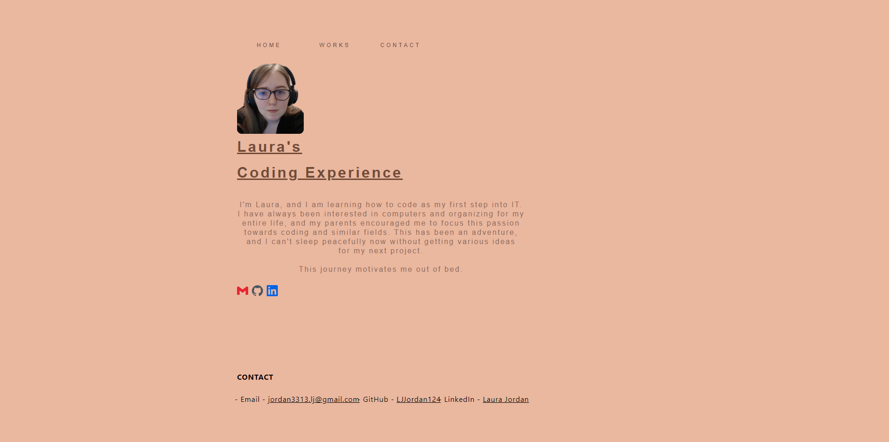

## Laura's Portfolio

## Description
This project was provided as a challenge to portray how individuals build their portfolios to showcase their skills and talents to employers to fill a part-time or full-time position. This was created in mind for when I am in search of a successful career after the Coding Bootcamp, as it is strongly suggested that having several deployed projects is a minimum requirement to receive an initial interview at many companies. This project was fully built from scratch.

## Deployed Application URL

https://ljjordan124.github.io/My-Portfolio/home.html

## Screenshot
The following image shows the web application's appearance and functionality:

## Features
This website features a navbar with the text HOME, WORKS, CONTACT. This is provided for employers to navigate through the website easily to gather information they might need. When HOME is clicked, you are provided the Home Screen (this will be the link provided from the start) that showcases basic information about Laura and icons that will take you to her profile for that website when clicked. When WORKS is clicked, you are provided a webpage that showcases many images of the projects that were worked on by Laura. For right now, when CONTACT is clicked, nothing happens. Please view the **Future Plans** section of this READ.ME to see what Laura plans on doing with it.

## Future Plans
Right now the Portfolio is under remodeling, and not everything is under a flexbox and media queries. I do understand nothing is centered and placements of things are weird, that will all be fixed, however, I have put my focus on preparing the Work Section of my portfolio. A Key function I would like to include in the Work Section of my portfolio is when an image of one of my projects is being hovered, the image is enlarged for the person viewing (will shrink back to normal when not hovering). Something I haven't planned too much on but will include, is the functionality of the CONTACT button in the navbar showcased in the Home Screen of the Portfolio.

## Languages & Dependencies
English

## Built With

* HTML
* CSS
* Javascript

## License
[MIT](https://choosealicense.com/licenses/mit/)

## Questions - Contact Me
* Email - jordan3313.lj@gmail.com
* LinkedIn - [Laura Delaney](https://www.linkedin.com/in/laura-jordan-510412241/)
